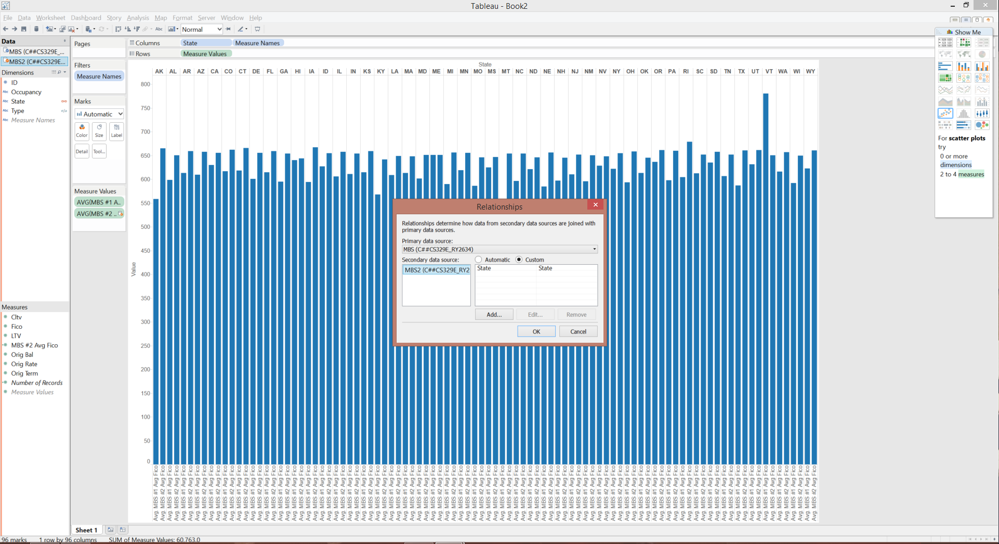
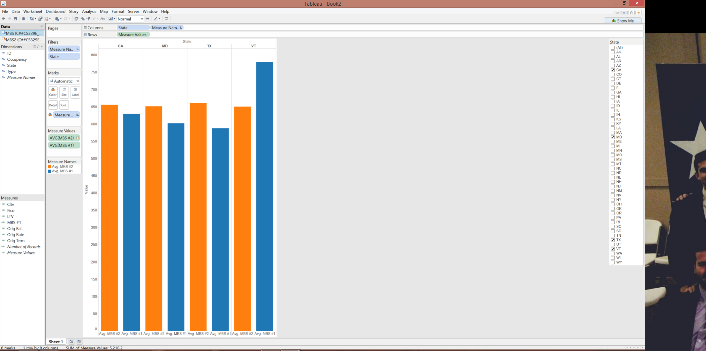

##** Connect to Data Sources **

```{r}
"
The first step is to connect to the data
We had 3 different data sources:
1) MBS #1
2) MBS #2
3) Unemployment Rates

MBS stands for Mortgage backed security. The MBS data sets are the underlying records of the mortgages that comprise the security. Each one has the fields: 
-ID (#)
-Occupancy (Owner Occupied, Second Home, Investor Owned)
-State
-Type (Fixed, Varaible)
-LTV (Loan-To-Value ratio of loan / home price)
-CLTV (Combined-Loan-To-Value ratio of all loans / home price)
-Orig Rate (Interest Rate)
-Orig Term (Length of mortgage in months)

The Unemployment data set has the following fields:
-State
-Unemployment Rate

We used the following info to connec to the database:
Server: 129.152.144.84
Service: ORCL.usuniversi01134.oraclecloud.internal
Port: 1521
Username: C##cs329e_ry2634
Password: orcl_ry2634
"

```

##** Visualization # 1:**

### Vis 1 - AVG FICO by State for both MBS #1 and MBS #2


### Vis 1 - Steps to reproduce
```{r}
"
Put State in columns
Put MBS #1 FICO in rows
"
```

```{r}
"
Set the data relationship to be by state
Change meausre values to be averages
"
```

```{r}
"
Add MBS #2 to the Y axis
Add color by measure name
Filter by state
"
```


##** Visualization # 2:**

### Vis 2 - Interest Rate V. Unemployment Rate by State


### Vis 2 - Steps to reproduce
```{r}
"
Put Occupancy in columns
Put Interest Rate in rows
Set the data relationship to be by state
"
```

```{r}
"
Added unemployment rate to the y axis
Converted measure values to be averages
"

```

```{r}
"Converted graph to scatterplot"
```

```{r}
"
Changed shape to filled in circles
Added color by state
Added state labels
Changed the axis range
"
```


### Vis 3 - AVG CLTV by State for both MBS #1 and MBS #2


### Vis 3 - Steps to reproduce
```{r}
"
Put State in columns
Put MBS #1 CLTV in rows
Put MBS #2 CLTV in rows
Set the data relationship by state
"
```

```{r}
"
Colored by measure names
Change measure values to be by avg
Filtered by State
Adjusted Y Axis
"
```


##** Visualization # 4:**

### Vis 4 - FICO V. Unemployment Rate by State


### Vis 4 - Steps to reproduce
```{r}
"
Put State in rows
Put Unemployment Rate in columns
Set the data relationship to be by state
Add FICO to y axis
"
```

```{r}
"
Convert to scatterplot
Change Axis
Fill shapes
Color by state
Add label by state
"

```


###Have a great day Mr. Li and Dr. Cannata!!!##


